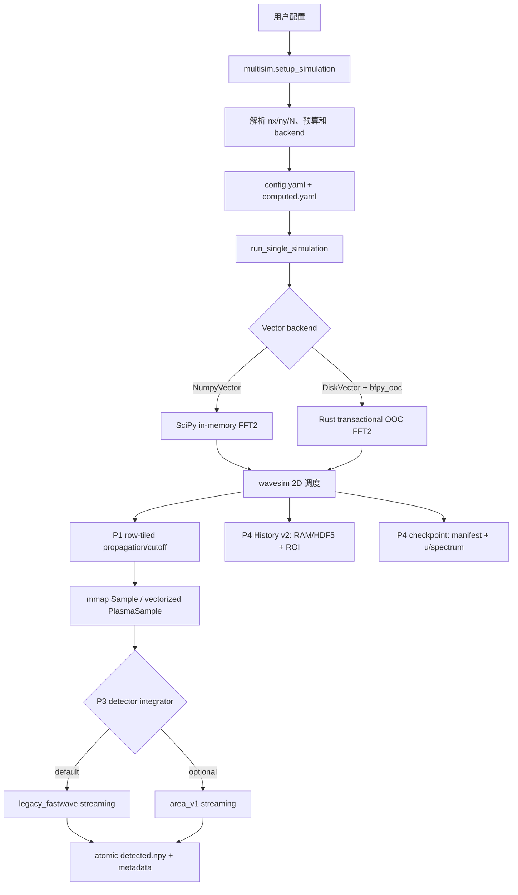

# Big-Wave 2D 当前实现架构（P5 验收后）

> 更新日期：2026-08-19  
> 当前阶段：P0 配置/资源契约、P1 局部算子瓦片化、P2 核外 FFT2、P3 流式二维
> detector、P4 History/兼容/检查点和 P5 科学/大规模验收已完成。  
> 下一发布门：P6 DSH 运行工程化与 R2 生产数据全量验收。

## 1. 当前定位

big-wave 2D 仍复用原有 1D 引擎的对象模型，但波场按 row-major 二维逻辑解释：

```text
logical shape = (ny, nx)
physical NPY shape = (nx * ny,)
flat_index = iy * nx + ix
```

当前已经内存有界的主干包括：

- 点源解析场生成；
- Fresnel 传递函数和二维 frequency cutoff；
- Sample/PlasmaSample 材料作用；
- DiskVector FFT2/IFFT2；
- `legacy_fastwave` / `area_v1` 二维 detector；
- Sample/Plasma 输入网格的 mmap 读取；
- canonical `(z,y,x)` History 的 HDF5 流式/ROI/下采样；
- 多源 y 与 source/job 输出隔离；
- 元件边界和 Sample/Plasma slice 边界运行检查点。

仍未完成的工程边界：

- checkpoint 尚不与 phase stepping 并用；Snapshot 与运行恢复点保持独立；
- DSH 持久化 job、ETA、进程组取消、并发限流和磁盘治理尚待 P6；
- 生产 capsule/真实 Plasma 网格的全量 R2 验收尚未完成；
- VectorSource、Grating、precise_Sample 不在当前范围，因为 fast-wave 2D 也未覆盖。

因此当前准确定位是：

> **在 fast-wave 已覆盖的 2D 功能范围内，传播、局部算子、FFT2、detector 和 History
> 已内存有界；16384² 真空/Sample/四 slice Plasma 已完成。当前剩余风险集中在 DSH
> 运维、phase-stepping 恢复语义和生产数据科学/性能门。**

## 2. 总体数据流



二维模式由 `SimParams.is_2d` 判断。`N == nx * ny`、正维度、2 的幂约束和完整行
`chunk_size` 在 setup/运行期检查。

## 3. 配置和资源契约

主要配置位于 `runtime.big_wave`：

```yaml
runtime:
  big_wave:
    memory_budget_gb: 6.0
    chunk_size: auto
    fft2_backend: bfpy_ooc
    detector_integrator: legacy_fastwave

use_disk_vector: true
sim_params:
  N: 268435456
  nx: 16384
  ny: 16384
```

规则：

- 2D 且 `use_disk_vector=true` 时，未显式指定 backend 会自动解析为 `bfpy_ooc`；
- `bfpy_ooc` 必须搭配 DiskVector；
- NumpyVector 使用 `scipy_in_memory`；
- DiskVector 不再提供 `np.load + scipy.fft2` 回退；
- `chunk_size=auto` 解析为完整行数；
- FFT2 转置 buffer 使用总内存预算的 50%；
- detector 输出大于内存预算时自动使用临时 NPY memmap；
- feasibility 同时检查 RAM、scratch/事务文件磁盘空间和 backend/vector 组合。

`computed.yaml` 记录 requested/resolved 参数、`tile_rows`、FFT2 pass、detector 积分器和
算法版本。每个 source 的 `detector_metadata.yaml` 记录有效几何及 count-map/coverage 统计。

## 4. P1 局部算子

### 4.1 点源、传播和 cutoff

`propagate_analytically_2d`、`propagate_2d` 和 `apply_frequency_cutoff_2d`：

- 只保留长度为 `nx`/`ny` 的轴坐标或频率数组；
- chunk 必须覆盖完整行；
- tile 内用广播生成二维临时值；
- 不创建整场 `flat/ix/iy`；
- c8 写回保持 complex64，complex128 临时量只存在于 tile。

### 4.2 Sample

三维材料索引网格以只读 `np.memmap` 打开。每个 z slice：

1. 按 wavefront y tile 计算映射坐标；
2. 从 mmap 读取四个双线性插值角点；
3. tile 内生成 δ/β 和材料因子；
4. 网格外保持真空；
5. 传播一个 `pixel_size_z`。

不再为整个 `(ny, nx)` slice 生成 complex128 `row_deltabeta`。

### 4.3 PlasmaSample

`ne/ni/Te/Z*` 四个网格同样只读 mmap。`plasma_delta_beta_grid` 用 NumPy 对 tile
向量化计算，Chantler element/energy 常数缓存复用，不再逐像素调用 Python 标量函数。

## 5. P2 核外 FFT2

### 5.1 Python API

bfpy 0.3.0 导出：

```text
fft2_c8 / ifft2_c8
fft2_c16 / ifft2_c16

(infile, outfile, scratch, nx, ny,
 progress_cb=None, cancel_token=None, memory_budget_bytes=None)
```

`DiskVector.fft2/ifft2` 直接调用这些 API。输入只读，正式 outfile 只在成功完成后替换。

### 5.2 四阶段算法


IFFT 在 column pass 统一乘 `1/(nx*ny)`。

### 5.3 内存复杂度

每个 FFT 行只保留一行及 RustFFT scratch。转置使用两个预算受控 tile：

```text
O(max(nx, ny) + transpose_tile_rows * transpose_tile_cols)
```

转置实现处理非整 tile 边缘；big-wave setup 当前仍把物理模拟限制为 2 的幂尺寸，bfpy
底层 API 已通过非 2 的幂边缘测试。

### 5.4 事务和恢复

每个完整 pass 执行：

1. 校验 NPY dtype、shape 和文件长度；
2. flush/fsync 数据文件；
3. 原子写入 manifest 的 completed pass；
4. 才允许下一 pass 开始。

中断规则：

- 正在写的 pass 不登记，重启时重做；
- 已登记 artifact 若结构损坏，自动退回前一安全 pass；
- 输入大小或 mtime、dtype、方向、nx/ny 改变时不复用旧 manifest；
- 完成前已有正式 outfile 保持不变；
- 成功后清理 scratch、column part 和 manifest。

路径检查覆盖规范路径、symlink 和 hardlink，防止 input/output/scratch 别名导致输入被截断。

### 5.5 进度和取消

progress callback 接收：

```text
(pass_name, completed, total)
```

pass name 为：

```text
row_fft
transpose_to_scratch
column_fft
transpose_to_output
complete
```

cancel token 可为 callable，或提供 `is_cancelled`、`is_set`、`cancelled`。Rust 运算期间释放
Python GIL，外部监控线程可以发出取消信号。`run_single_simulation` 已透传 progress/cancel。

## 6. 文件布局和峰值磁盘

运行中的一个 FFT2 最多同时涉及；逻辑频域场统一命名为 `spectrum.npy`，不再使用仅大小写
不同的 `u.npy/U.npy`：

```text
input.npy                       # 只读波场
outfile.npy                     # 旧正式输出，可不存在
outfile.npy.part                # row pass / 最终事务输出
scratch.npy                     # 第一次转置结果
scratch.npy.column.part         # column FFT 事务结果
scratch.npy.fft2.manifest       # pass 恢复点
```

除 input 和旧 outfile 外，FFT2 峰值额外空间约为三个波场。feasibility 额外要求 20% 磁盘余量。

## 7. P3 流式 detector 与 P4 History/检查点

### 7.1 双积分器

`square_and_downsample_2d` 根据 `detector_integrator` 分派：

- `legacy_fastwave`（默认，`legacy_fastwave_stream_v1`）：保留 fast-wave CUDA 的像素中心、
  截断趋零边界和 count-map 语义；
- `area_v1`（可选，`area_separable_stream_v1`）：把波场网格单元视为分片常数，按与
  detector pixel 的 x/y 重叠长度积分。

两个路径都按如下数据流运行：

```text
wave row tile -> |u|² row -> 1D x prefix/integral
              -> active detector rows -> fused cos(angle) accumulation
```

不会创建整场 float64 强度、二维前缀和、`ny × detector_nx` 中间矩阵或输出大小的
`meshgrid`。几何余弦在活动 detector 行累加时融合应用，没有第二次全输出扫描，也没有
额外 `1/r`。

### 7.2 输出内存和事务提交

detector 输出不超过 `memory_budget_gb` 时使用 RAM；超过时建立临时 NPY memmap。新文件
依赖截断文件的逻辑零页，不预触碰完整输出。处理完成的 tile 会 flush 并丢弃文件页。

单相位 memmap 输出通过等长 NPY header 改写直接增加 phase 轴，随后原子重命名为
`detected.npy`，不复制整个图像。多相位或跨设备回退使用固定 8 MiB 顺序 I/O 和
`.part -> atomic replace`。

### 7.3 告警、metadata 和 Fresnel 几何

`legacy_fastwave` 在 detector pixel/grid 比值非整数或存在零计数 pixel 时发出
`RuntimeWarning`。`detector_metadata.yaml` 保存：

- integrator 和 version；
- output shape/storage；
- 有效 `dx/dy`、pixel size、`current_z`、Fresnel magnification；
- count-map 的 min/max/mean/zero/non-uniform，或 `area_v1` coverage area 统计。

Fresnel detector 保持由物理 pixel size 决定的输出形状，但积分窗口使用 `pixel_size/M`
和 `z_eff`，与 fast-wave detector 调用约定一致。

### 7.4 History v2

2D History canonical 轴序为 `(z,y,x)`，metadata 记录 `format_version=2` 和轴序。小 History
可留在内存；预测超过预算时写入可扩展 HDF5 dataset。写入前可应用 y/x ROI 和下采样，
并支持 `max_frames`、progress/cancel。`history_x/history_y` 对应输出后的居中物理坐标。

`load_history` 能识别旧 `(y,x,z)` 文件并显式转置；`migrate_legacy_history` 生成新文件且不
覆盖源文件。解析点源 History 逐行计算，不再创建全场 `meshgrid`。

### 7.5 运行检查点

`RunCheckpoint` 用 UUID generation NPY、SHA-256 manifest 和原子替换保存：

```text
u, spectrum, current_z, element_index, slice_index,
phase_step, fourier_valid, stage, config_fingerprint
```

wavesim 在 source 完成、每个 Sample/Plasma slice、元件完成和 detector-ready 阶段提交恢复
点。恢复时不重放已完成 slice。Snapshot 是相位步进数据结构，不是运行检查点；当前若同时
请求 phase stepping 和 checkpoint 会明确报错。

## 8. 功能状态矩阵

| 功能 | 当前状态 | 说明 |
|---|---|---|
| PointSource 2D | 已实现 | `(x,y,z)` 球面波 |
| NumpyVector FFT2 | 已实现 | SciPy，小规模参考 |
| DiskVector FFT2 | P2 已实现 | bfpy 事务式核外 c8/c16 |
| Fresnel propagation/cutoff | P1 已实现 | 完整行 tile |
| Sample 2D | P1 已实现 | mmap + tile 双线性插值 |
| PlasmaSample 2D | P1 已实现 | mmap + vectorized δ/β |
| legacy detector | P3 已实现 | CUDA 截断语义 + 流式 count-map |
| area_v1 detector | P3 已实现，可选 | 可分离面积权重，默认不启用 |
| History | P4 已实现 | `(z,y,x)`、HDF5/ROI/downsample、旧格式迁移 |
| 运行 checkpoint | P4 已实现 | manifest/checksum，元件与 Sample/Plasma slice 恢复 |
| 多源 y | P4 已实现 | 配置、Nyquist、subconfig/computed provenance |
| VectorSource 2D | 未正确分派 | 当前范围外 |
| Grating/EnvGrating 2D | 未完整实现 | 当前范围外 |
| precise_Sample 2D | 未实现 | 当前范围外 |

## 9. 验证入口

- P0：`tests/big_wave_2d/test_p0.py`
- P1：`tests/big_wave_2d/test_p1.py`
- P2：`tests/big_wave_2d/test_p2.py`
- P2 kill helper：`tests/big_wave_2d/p2_kill_worker.py`
- P2 RSS probe：`tests/big_wave_2d/p2_benchmark.py`
- P2 报告：`tests/big_wave_2d/P2_TEST_REPORT.md`
- P3：`tests/big_wave_2d/test_p3.py`
- P3 RSS probe：`tests/big_wave_2d/p3_benchmark.py`
- P3 报告：`tests/big_wave_2d/P3_TEST_REPORT.md`
- P4：`tests/big_wave_2d/test_p4.py`
- P4 报告：`tests/big_wave_2d/P4_TEST_REPORT.md`
- P5：`tests/big_wave_2d/test_p5.py`
- P5 大规模入口：`tests/big_wave_2d/p5_benchmark.py`
- P5 报告：`tests/big_wave_2d/P5_TEST_REPORT.md`

P0–P5 聚合回归为 68/68。P5 还覆盖点源/倾斜平面波/薄层/Beer–Lambert/cutoff/矩孔、
薄钨片、空心胶囊、Plasma 1D/2D 中心线和 fast-wave 交叉验证；偏移点源 detector 的跨引擎
相对 L2 为 `2.278e-7`。

## 10. P5 大规模状态与下一步

固定 3.2768 mm 物理域、512 MiB OOC 预算下，16384² 真空、单 slice Sample 和四 slice
PlasmaSample 的峰值 RSS 分别为 626.7、627.8、660.7 MiB，进程 swap 均为 0；wall time
分别为 159、200、692 s。8192²→16384² 的 Sample/Plasma 中心线相对 L2 为 3.76%，
detector 能量相对差约 `7.2e-5`，误差随网格细化下降。

下一步：

1. P6 接入持久化 job、阶段 ETA、进程组取消、错误分类、并发/磁盘限流；
2. 在改名修复后专项复测 DrvFS 大事务文件；此前生产 OOC scratch 使用 WSL ext4/NVMe；
3. 冻结成像 ROI 的正式科学容差和指定 NVMe 软性能门；
4. 使用生产 capsule/真实 Plasma 网格关闭 R2 全量验收；
5. 单独设计 phase stepping 多相位 checkpoint 事务语义。
