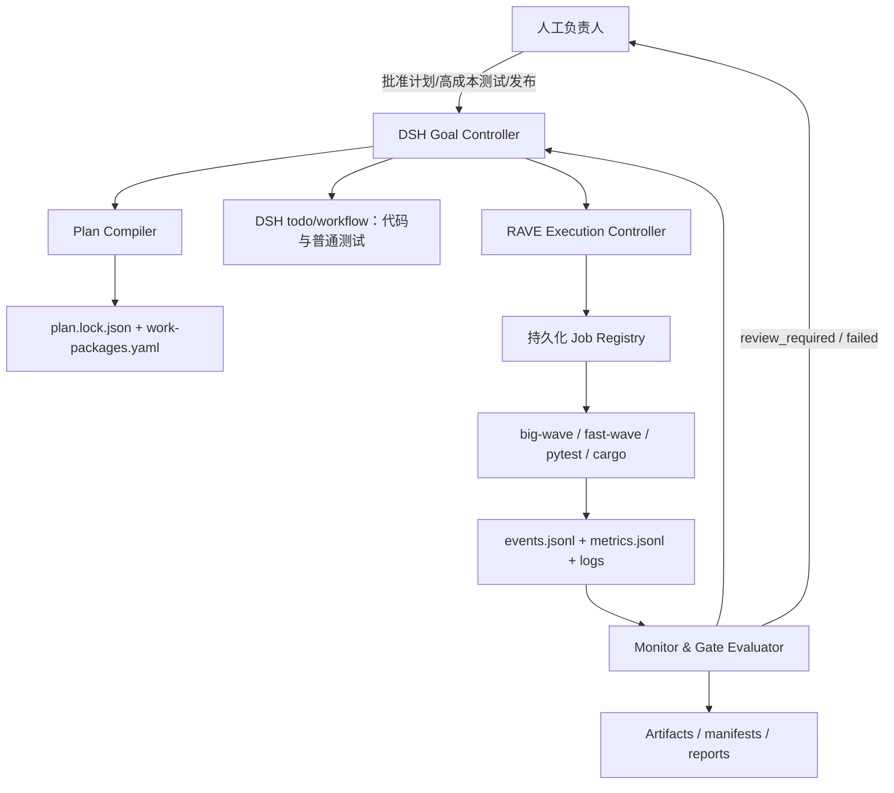
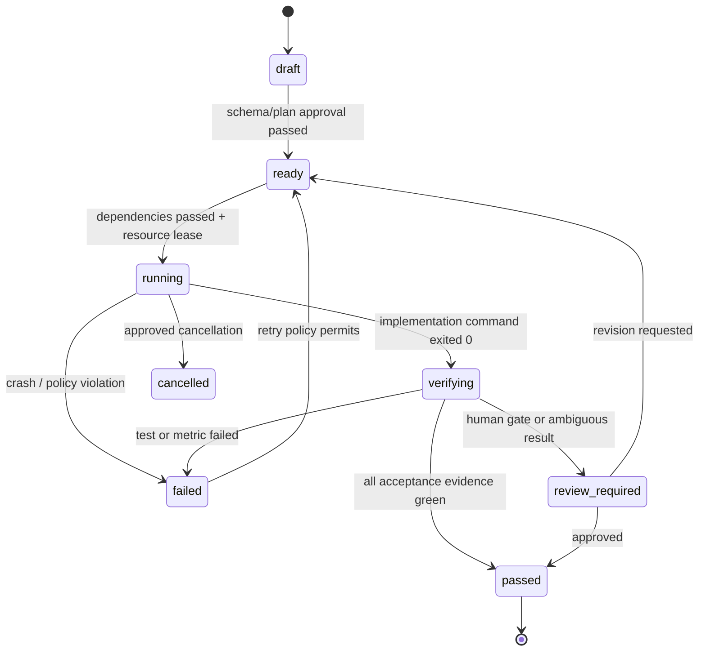

# RAVE-SIM Big-Wave 2D 修改计划（评审修订版）

> 修订日期：2026-08-19  
> 方案状态：R1 核心门已通过；P0–P5 核心验收完成。R2 仍需 P6 DSH 运维和生产级
> capsule/真实 Plasma 数据全量验收，完成后才能称“达到 1D 的工程完成度”。
>
> 核心原则：
> 1. big-wave 的 2D 发展以 **fast-wave 已覆盖的 2D 功能范围**为边界；
> 2. fast-wave 尚未支持的 2D 功能，big-wave 本次**不扩展**；
> 3. 共享配置、工具链、DSH 保持双引擎兼容；
> 4. 探测器积分器保留两种选项，默认继续兼容 fast-wave，后续再统一；
> 5. `auto`、内存预算、临时目录等运行策略与引擎数值配置分层；
> 6. 所有结果记录算法版本、后端和解析后的资源参数，保证可追溯。

> 实施进度（2026-08-19）：P0–P5 聚合回归 68/68。P4/P5 结果见
> `tests/big_wave_2d/P4_TEST_REPORT.md` 和 `tests/big_wave_2d/P5_TEST_REPORT.md`。
> 16384² 真空、单 slice Sample、四 slice PlasmaSample 均已完成；当前下一项为 P6，
> 同时保留生产级 capsule/真实 Plasma 网格的 R2 全量验收。

---

## 1. 背景与当前状态

方案制定时，big-wave 的 2D 支持尚未达到 1D 的完成度，主要缺口是整幅内存 FFT2、
二维探测器整幅前缀和、局部算子未完整瓦片化，以及资源预检和运行监控不足。

截至 2026-08-19：

- P0 已补齐配置契约、资源预检和错误识别的首阶段能力；
- P1 已完成样品、等离子体和传播局部算子的瓦片化；
- P2 已将 `DiskVector.fft2/ifft2` 替换为 bfpy 事务式核外 FFT2，不再走整幅
  `np.load + scipy.fft2` 路径；
- P3 已把二维探测器改为双积分器流式实现，去除整场强度和二维前缀和；
- P4 已完成多源 y、History v2 流式/ROI/下采样和运行检查点；
- P5 已完成解析/成像/fast-wave 交叉验证和三档大规模端到端验收；
- DSH 阶段监控、持久化 job 与生产数据全量运行仍由 P6/R2 完成。

本次修改的目标是：

> 在 fast-wave 已支持的 2D 功能范围内，让 big-wave 成为“内存有界、真正核外、可验证、可恢复的大规模二维引擎”。

---

## 2. 范围界定

### 2.1 本次纳入范围

| 功能 | 原因 |
|---|---|
| 2D 点源初始化与传播 | fast-wave 已支持 |
| 2D `Sample` | fast-wave 已支持 |
| 2D `PlasmaSample` | fast-wave 已支持 |
| 2D 频率截止 / Fresnel 传播 | fast-wave 已支持 |
| 核外 FFT2 / IFFT2 | big-wave 核心缺口 |
| 二维探测器 | fast-wave 已有实现，big-wave 需兼容/可选升级 |
| 多源 y 坐标 | fast-wave 的 2D point source 已读取 `source.y` |
| 小规模 2D History 格式兼容 | R1 必须覆盖 |
| 大规模流式 History / 运行检查点 | R2 必须覆盖 |
| 资源预检 / DSH 监控 | 双引擎共享工具链，需兼容 |

### 2.2 本次明确不纳入 / 延后

| 功能 | 原因 |
|---|---|
| 2D `Grating` / `EnvGrating` | fast-wave 2D 模式当前不支持，直接抛异常 |
| 2D `VectorSource` | fast-wave 2D 模式当前不支持，直接抛异常 |
| 2D `precise_Sample` | fast-wave 2D 模式当前不支持，直接抛异常 |
| 2D `SaveAndExit` 光学器件 | fast-wave 未发现对应 2D 支持；运行检查点是可靠性机制，不受此项排除影响 |
| `detector_integrator: area_v1` 默认切换 | 需要等 fast-wave 同步实现后再统一切换 |

> 如果后续 fast-wave 补上上述功能，再单独评估 big-wave 是否需要同步补齐。

---

## 3. 验收标准（更新后）

在 fast-wave 已覆盖的 2D 功能范围内：

- 16384×16384、`complex64` 能在 13 GiB WSL 下完成，峰值 RSS ≤ 4–6 GiB；R1 先验收真空和薄样品，完整 capsule / PlasmaSample 放到 R2；
- `use_disk_vector=true` 时，FFT、传播、样品、探测器均不加载整幅波场；
- Sample / PlasmaSample 的输入网格使用只读 mmap 或等价切片读取，不得由 `np.load` 隐式整数组载入；
- 内存需求随 `chunk_size/tile_rows` 有界，而不是随 `nx×ny` 全量增长；
- FFT2 与 NumPy 参考的相对 L2 误差：c8 ≤ `1e-5`，c16 ≤ `1e-12`；
- 均匀场探测器在流式 `legacy_fastwave` 下保持与 fast-wave 一致；
- `area_v1` 作为可选积分器通过物理正确性测试，但默认不切换；
- 通过点源、`Sample`、`PlasmaSample`、2D History、多源 y 坐标等 fast-wave 已覆盖场景的交叉验证；
- History 小规模输出统一为 `(z, y, x)` 并带 `format_version`，旧 `(y, x, z)` 文件仍可由兼容读取器识别；
- DSH 能在运行前拒绝必然 OOM 的任务，并正确识别退出码 137 / SIGKILL / `MemoryError`；
- 输出 metadata 至少包含 `algorithm_version`、`fft_backend`、`detector_integrator`、Git commit 和解析后的资源参数。

---

## 4. 目标架构


基本约束：`N == nx * ny`。R1 要求 `nx`、`ny` 分别为 2 的幂；“非方形支持”仅指例如 `4096 × 8192`。任意尺寸需等边缘 tile 安全处理完成后再开放。

磁盘中保留：

- `u.npy`：空间域波场
- `spectrum.npy`：频域波场；不得使用仅大小写不同的 `u.npy/U.npy`
- `scratch.npy`：转置/FFT 工作文件
- `output.part.npy`：事务性输出，完成校验后原子替换正式输出
- `run_manifest.json`：记录各 pass 的状态、shape、dtype、长度和校验信息
- 可选的探测器中间文件

输入、输出、scratch 和 `.part` 的解析后路径必须互不相同。多源并发时，每个 job/source 使用唯一工作目录。

磁盘需求按实际阶段估算，不能固定写成“10–12 GiB”：

```text
disk_required = input + final_output + scratch
              + transactional_output + history
              + checkpoint + debug_outputs
```

要求 `free_disk >= 1.2 * disk_required`。16384² c8 的单个复数场文件约 2 GiB，仅四份基础场文件就约 8 GiB，尚未计入 History、检查点和多源并发。

---

## 5. 分阶段修改计划

### P0：先阻止 OOM 和错误放行

预计 1–2 天。

修改：

- `big-wave/multisim.py`
  - 强制 `N == nx * ny`，并在配置中显式保存 `nx`；
  - R1 强制 `nx`、`ny` 分别为 2 的幂；不满足时在启动前拒绝，而不是进入 Rust 后端失败；
  - 2D 大规模配置禁止解析后的 `chunk_size >= N`；
  - 将 chunk 自动换算成完整行数：`tile_rows = max(1, chunk_size // nx)`，实际 chunk 为 `tile_rows * nx`；
  - 解析 `runtime.big_wave.memory_budget_gb` 和 `runtime.big_wave.chunk_size: auto`，生成引擎配置前将其解析为整数；
  - 检查二维圆形 cutoff 的实际 x/y 最大频率不超过 `1/(2*dx)`、`1/(2*dy)`，并将所用公式写入 computed metadata；
  - 保持 `computed.yaml` 中 `cutoff_angles` 仍为单一标量列表，兼容 fast-wave。

- `rave_agent/validate_sim.py`
  - big-wave 单独估算 RAM，不复用 GPU 的 `3×wave` 公式；
  - 分别估算点源、FFT、样品、探测器、history、snapshot 的峰值；
  - 读取 WSL `/proc/meminfo`，使用可用物理内存做 80% 门控；swap 不计入正常余量，只作为单独警告或降级指标；
  - 按后端和运行阶段估算，而不是只给一个整场倍数；网格 mmap、FFT、探测器、History 和事务输出都计入；
  - 估算每次 FFT 时间、有效磁盘吞吐、总 I/O 和预计总时长，并明确 NVMe/磁盘假设；
  - 识别退出码 137、`SIGKILL` 和 `MemoryError`；
  - **保持 fast-wave 的 GPU VRAM 估算路径独立**，不被 big-wave RAM 门控影响。

配置分层如下。用户输入允许 `auto`，生成给 big-wave 的 `sim_params` 必须是确定数值；不能把字符串 `auto` 直接交给当前要求整数 `chunk_size` 的引擎配置解析器。

```yaml
runtime:
  big_wave:
    memory_budget_gb: 6
    chunk_size: auto
    fft2_backend: bfpy_ooc
    detector_integrator: legacy_fastwave
    save_debug_wavefields: false

sim_params:
  use_disk_vector: true
  nx: 16384
  ny: 16384
  chunk_size: 4194304  # setup 根据预算解析出的整数示例
```

`computed.yaml` 还应保存上述 runtime 值及其 resolved 值，供复现和 DSH 展示。

### P1：二维局部算子全部改为按行/瓦片处理

预计 3–5 天。

涉及：

- `big-wave/propagation.py`
  - `propagate_analytically_2d`
  - `propagate_2d`
  - `apply_frequency_cutoff_2d`
- `big-wave/optical_element.py`
  - `Sample._apply_2d`
- `big-wave/plasma_sample.py`
  - `PlasmaSample._apply_2d`

实施方式：

1. chunk 必须按完整行切分，例如每次处理 32–256 行；
2. 预计算长度仅为 `nx`、`ny` 的坐标和频率数组；
3. 使用广播，避免为每个 chunk 创建完整 `flat/ix/iy`；
4. Sample / PlasmaSample 网格以 `np.load(..., mmap_mode="r")` 或等价机制打开，按 z/y tile 读取；禁止隐式整幅复制、转置或 dtype 提升；
5. 样品/等离子体的 `row_deltabeta` 必须按 y tile 提取，禁止一次性生成整幅 `(ny, nx)` complex128；
6. 将 PlasmaSample 的逐像素 `plasma_delta_beta` 调用改为向量化 tile 计算；按元素和能量缓存 Chantler 常数，必要时增加可复用的 deltabeta slice 磁盘缓存；
7. `complex128` 临时值严格限制在 tile 内，写回时转换为 c8；
8. 保持与 fast-wave 相同的坐标映射和越界语义，避免交叉验证分叉。

P1 验收不仅看“不 OOM”，还必须比较不同 `tile_rows` 的结果不变性、峰值 RSS 和 PlasmaSample 每 slice 用时。逐像素 Python 调用未消除时，P1 不算完成。

### P2：在 big-fourier 中实现真正的核外 FFT2

状态：**已完成（2026-08-19）**。已实现 bfpy 0.3.0 事务式 OOC FFT2/IFFT2、
DiskVector 接入、进度/取消、manifest 恢复以及 c8/c16/非方形/kill-restart 测试。
P2 的完成只解除 FFT2 峰值；该阶段遗留的 detector 峰值已由 P3 解除，History/输出生命
周期已由 P4 收口，完整大样例已在 P5 分级验收。

核心任务，预计 1–2 周。

建议新增：

- `big-fourier/src/bfft2.rs`
- Python API：
  - `bfpy.fft2_c8(infile, outfile, scratch, nx, ny, progress_cb, cancel_token)`
  - `bfpy.ifft2_c8(...)`
  - c16 对应接口

算法：

1. 从输入文件逐行读取 `nx` 个复数；
2. 使用 RustFFT 对每行执行 FFT，写入唯一的事务输出 `.part`，完成 `row_fft` pass 后校验并登记 manifest；
3. 将 `.part` 分块转置到 `scratch`：`(ny, nx)` → `(nx, ny)`；R1 的 tile 大小由内存预算确定，且必须覆盖边缘安全测试；
4. 对 `scratch` 的每一行执行长度 `ny` 的 FFT，即原矩阵列 FFT，并完成 `column_fft` pass；
5. 将 `scratch` 再次转置回 `(ny, nx)` 的 `.part`，校验、`fsync` 后原子替换正式 `outfile`；
6. IFFT 最后统一乘 `1/(nx*ny)`。

内存复杂度：

```text
O(max(nx, ny) + transpose_tile²)
```

修改 `big-wave/vector.py`，让 `DiskVector.fft2/ifft2` 调用 Rust 接口，删除当前整幅 `np.load + scipy.fft2`。

需要同时实现：

- c8/c16；
- 方形和 2 的幂非方形尺寸；任意尺寸留到支持非整 tile 边缘后；
- 输入、输出、scratch、`.part` 路径冲突检测，且不修改输入文件；
- 每一 pass 写 manifest，重启时只复用已完整校验的 pass；
- 校验 `.npy` header、shape、dtype、文件长度，`fsync` 后原子替换正式输出；
- 中断后的 scratch 安全清理或保留为可恢复状态；
- FFT pass 进度回调和取消检查为必需接口，供 DSH 使用，不再列为可选项。

P2 必测：c8/c16、方形/非方形、正反变换、输入不变、header/shape/dtype、进程在各 pass 被 kill 后的重启与恢复。

### P3：二维探测器保留双积分器，默认兼容 fast-wave

预计 3–5 天。

> 实施状态（2026-08-19）：已完成。默认 `legacy_fastwave_stream_v1`、可选
> `area_separable_stream_v1`、输出 memmap/原子提交、告警/metadata、Fresnel 有效几何、
> progress/cancel 和资源模型均已通过 `tests/big_wave_2d/test_p3.py` 验收。

原则：

- **不立即改变 fast-wave 兼容行为**；
- 新增 `detector_integrator` 配置项：
  - `legacy_fastwave`：保持与 fast-wave 像素级一致的整数截断语义，但必须重写为流式实现，作为默认；
  - `area_v1`：可分离面积权重积分，作为可选实现，默认不启用；
- 后续等 fast-wave CUDA 探测器同步实现 `area_v1` 后，再统一切换默认值。

`legacy_fastwave` 不能保留当前整幅 `W/S` 前缀和实现。建议算法：

1. 预计算每个探测器像素对应的 x/y 整数边界；
2. 逐行或逐 y tile 读取波场并计算 `|u|²`；
3. 只对当前行做 x 区间和，得到长度为 `detector_nx` 的行向量；
4. 按预计算的 y 边界直接累加到当前活动的探测器行；若输出本身超过预算，则输出也使用 memmap；不得在 RAM 中创建 `ny × detector_nx` 中间矩阵或整场前缀和；
5. 当 `detector_pixel_size/dx` 非整数或存在零计数像素时输出警告，并把 count-map 统计写入 metadata。

`area_v1` 实现（可选，默认不启用）：

1. 预计算仿真网格单元与探测器像素在 x 方向的重叠长度；
2. 对每个波场行 tile 计算 `|u|²`；
3. 先进行 x 方向加权积分；
4. 再按 y 方向重叠权重累加到探测器输出；
5. 在活动 detector 行累加时融合 `cos(angle)`，不增加额外 `1/r`，避免第二次完整输出扫描。

优点：

- RAM 只与 tile 和探测器输出大小有关；
- 非整数 `detector_pixel_size/dx` 时恒定波场保持恒定；
- 不需要 `correct_countmap.py`；
- 能严格检查总入射功率与探测器积分功率。

两种积分器都必须考虑 Fresnel 缩放后的有效 `dx/dy`、有效探测器像素尺寸和当前 z。结果 metadata 必须记录 `detector_integrator` 及其版本，避免默认值变化造成静默结果漂移。

### P4：仅补齐 fast-wave 已覆盖的 2D 功能

预计 1–2 周，可与测试并行。

> 实施状态（2026-08-19）：已完成。多源 y、canonical `(z,y,x)` History v2、旧轴迁移、
> HDF5 流式/ROI/下采样、进度/取消、checksum manifest 和 Sample/Plasma slice 恢复已通过
> `tests/big_wave_2d/test_p4.py` 11/11。checkpoint 与 phase stepping 组合当前显式拒绝。

本次只做：

- **多源 y 坐标**
  - `multisim` 读取并生成 `y_range`；
  - `subconfig.yaml` 保存 `source.y`；
  - `computed.yaml` 的 `source_points` 保存 `y`；
  - 保持 fast-wave 可解析。

- **History / 快照**
  - R1 先统一小规模输出为 canonical `(z, y, x)`，写入 `format_version`，并提供旧 `(y, x, z)` 的兼容读取/迁移；
  - `history_x/history_y` 采用居中坐标定义，并增加轴顺序测试；
  - R2 增加下采样、ROI 和磁盘流式写入，避免 History 的整场 `meshgrid` 或堆叠成为新 OOM 点；
  - phase-stepping Snapshot 与运行检查点使用不同的数据结构和命名；
  - 检查点保存 `u/U`、当前 z、元件和 slice 索引，以及可验证的 manifest，以便长任务续跑。

明确不做：

- 2D `Grating` / `EnvGrating`
- 2D `VectorSource`
- 2D `precise_Sample`
- 2D `SaveAndExit` 光学器件；运行检查点仍按可靠性需求实现

直到 fast-wave 先支持这些功能，再单独评估。

### P5：建立可信的二维测试体系

预计 5–7 天。

> 实施状态（2026-08-19）：核心发布门已完成。P5 独立测试 10/10、P0–P5 聚合 68/68；
> 4096²/8192²/16384² 真空、Sample 和四 slice PlasmaSample 已在固定物理域完成，16384²
> 峰值 RSS 626.7–660.7 MiB、进程 swap 为 0。详见 `tests/big_wave_2d/P5_TEST_REPORT.md`。
> 生产级 capsule/真实流体网格属于 R2 全量验收，尚未因此自动关闭。

测试工作从 P0 开始伴随各阶段提交，P5 只做汇总验收，不能等全部实现后再集中补测试：

| 阶段门 | 必须通过后才能进入下一阶段 |
|---|---|
| P0 | 配置解析、`N/nx/ny`、资源不足、磁盘不足、非法 cutoff 等正反例 |
| P1 | tile size 不变性、输入网格 mmap、峰值 RSS、Plasma 向量化性能 |
| P2 | NumPy 对照、IFFT 回环、事务提交、kill/restart 恢复 |
| P3 | 整数/非整数像素比、零计数警告、能量与 Fresnel 缩放 |
| P4 | y 偏移、多源隔离、History 轴序/版本、checkpoint 恢复 |
| P5 | 端到端交叉验证和分级大规模性能验收 |

测试范围限制在 fast-wave 已覆盖的功能：

#### 1. 算子单测

- FFT2 随机复数数组对比 NumPy；
- FFT2 → IFFT2 回到原数组；
- 方形、非方形、c8、c16；
- 分块大小改变时结果不变；
- 中途文件和输入文件不被破坏。

FFT 误差统一使用相对 L2：

```text
relative_L2 = ||u_test - u_ref||₂ / max(||u_ref||₂, eps)
```

#### 2. 解析物理测试

- 点源球面波幅度 `1/r` 和相位；
- 平面波/倾斜平面波传播；
- 均匀薄层：
  - 去除同厚度真空传播的公共相位后，使用圆周相位误差；
  - Beer–Lambert 吸收误差；
- 均匀场探测器：
  - `legacy_fastwave` 与 fast-wave 一致；
  - `area_v1` 无周期条纹、能量守恒（作为可选测试）；
  - 整数和非整数 `detector_pixel_size/dx`；
  - Fresnel 缩放下的有效探测器像素和总能量。
- cutoff 测试必须覆盖轴向和对角方向，并验证实际二维圆形 cutoff 公式，不只检查一个标量角度。

#### 3. 成像测试

- 矩孔或圆孔 Fresnel 解析解；
- 薄钨片；
- 空心球壳/胶囊；
- `PlasmaSample` 1D 截面与 2D 中心线一致性；
- x/y 非零点源和偏移样品。

fast-wave/big-wave 以及 8192²/16384² 的图像比较前，先重采样到同一物理坐标网格。禁止直接对不同采样间距的数组做逐像素 RMSE。

#### 4. 大规模验收

大规模验收分级进行：

1. 16384² c8 真空传播；
2. 16384² c8 单 slice Sample；
3. 16384² c8 四 slice PlasmaSample；
4. 完整 capsule / PlasmaSample 作为 R2 性能与稳定性验收，不作为首个功能门。

共同要求：

- WSL 内存上限 13 GiB；
- RSS 峰值 ≤ 6 GiB；
- 不使用 swap 或只少量使用；
- 任务完成并生成探测器输出；
- 与 8192² 收敛结果、fast-wave 结果比较；
- 同时检查相对 L2、圆周相位误差、能量、解析误差和分辨率收敛；
- 记录每次 FFT 时间、总 wall time、读写字节数和有效磁盘吞吐；
- 在指定 NVMe 基准环境上给出软性能门槛。若只满足内存门而耗时不可接受，不得标记为“大规模可用”。

### P6：DSH 与运行工程化

预计 3–5 天。

增加状态阶段：

```text
initializing
fft_rows
transpose_1
fft_columns
transpose_2
sample_slice i/n
detector_integrate
saving
```

并支持：

- 每阶段 RSS、swap、磁盘空间监控；
- 剩余时间估算；
- 安全取消：终止完整进程组，等待子进程退出，并只清理由本 job manifest 声明的临时文件；
- 崩溃后保留最近检查点；
- 区分 OOM、磁盘满、数值参数非法和普通异常；
- 不再固定读取 `00000000`，使用实际 `source_idx`；
- 进度事件定义为 P2/P3/P4 的必需接口，P6 负责聚合展示，而不是到 P6 再补底层回调；
- **保持 fast-wave 兼容**：big-wave 专用阶段不能影响 fast-wave 的任务状态机。

---

## 6. 推荐发布顺序与工期

| 发布 | 内容 | 出口标准 | 预计单人开发量 |
|---|---|---|---|
| R1 核心可用 | P0 配置/资源门、网格 mmap、局部算子瓦片化、Plasma 向量化、事务性 OOC FFT2、流式 legacy detector、小规模 canonical History、阶段测试 | 16384² 真空和薄 Sample 在 13 GiB 环境完成；结果与参考在容差内；kill 后可恢复或安全重启 | 2–3 周 |
| R2 完整对齐 | `area_v1`、y 多源完善、大规模流式 History、checkpoint、完整 DSH 进度/取消/错误、Plasma/capsule 全量验证、性能文档 | fast-wave 已覆盖范围的功能、科学验证和运维验收全部通过 | 额外 1–2 周，整体按 4–6 人周留量 |

DSH 可以缩短脚手架、状态展示和部分测试代码的实现时间，但不会消除 Rust OOC FFT、Plasma 向量化、I/O 压测和物理交叉验证的工作量。合理预期是 R1 约 2–3 个日历周，R2 后整体约 3–4 个日历周；项目排期仍按 4–6 人周管理，避免把自动生成代码等同于验收完成。

---

## 7. fast-wave 兼容性矩阵

| 修改项 | 是否影响 fast-wave | 处理方式 |
|---|---|---|
| 新增 `runtime.big_wave.memory_budget_gb` / `chunk_size: auto` | 低风险 | setup 先解析为数值；fast-wave 不直接接收字符串 `auto`，共享引擎配置保持数值型 |
| 显式保存 `nx` | 正向兼容 | fast-wave 2D 解析本来就要求 `nx` |
| 修改 `cutoff_angles` 结构 | 高风险 | 继续输出单一标量列表，避免破坏 fast-wave |
| `detector_integrator: legacy_fastwave` | 无影响 | 默认保持 fast-wave 像素级一致 |
| `detector_integrator: area_v1` | 有影响 | 仅可选，不默认；等 fast-wave 同步后再切换 |
| 2D Grating / VectorSource / precise_Sample | 无影响 | 本次不做，fast-wave 也不支持 |
| 多源 y 坐标 | 兼容 | fast-wave 已读取 `source.y` |
| History canonical `(z,y,x)` / 磁盘流式 | 有迁移风险 | 写入 `format_version`，提供旧 `(y,x,z)` 兼容读取器；大规模流式放到 R2 |
| `validate_sim.py` 内存估算 | 有影响 | 必须按 engine 分支，不能影响 fast-wave GPU 估算 |
| DSH 状态阶段 | 有影响 | big-wave 专用阶段与 fast-wave 状态机隔离 |

---

## 8. 主要风险与注意事项

1. **FFT2 数值差异**：big-wave 的 Rust 核外 FFT2 与 fast-wave 的 cuFFT 舍入顺序不同，交叉验证应使用明确容差，不追求逐位相等。
2. **事务与恢复**：两次转置意味着一次 FFT2 可能需要第四份临时场；磁盘不足、取消和进程被 kill 都必须通过 manifest 判断 pass 是否完整，不能凭文件存在就复用。
3. **I/O 放大**：16384² c8 单场约 2 GiB，多个 z slice 会产生数十到数百 GiB，甚至更高的累计读写；必须把“内存可跑”和“时间可接受”分开验收。
4. **样品/等离子体物理语义**：big-wave 和 fast-wave 当前在越界处理、坐标映射上已有细微差异；修改 big-wave 时不能单方面改变语义，否则交叉验证会失败。
5. **Plasma 性能**：只做 tile 化而保留逐像素 Python 函数调用，会把 OOM 变成不可接受的运行时间；向量化和常数缓存是 R1 阻断项。
6. **探测器默认值**：在 fast-wave 未同步 `area_v1` 前，不要把 big-wave 默认切换为 `area_v1`；非整数像素比必须警告并记录 count-map 统计。
7. **cutoff 语义**：二维圆形 cutoff 与逐轴 Nyquist 约束不同；必须测试轴向和对角方向，并在 metadata 中保存实际公式/版本。
8. **资源预检**：big-wave 的 RAM 门控和 fast-wave 的 GPU VRAM 门控必须分开维护；swap 不能被当作正常内存余量。
9. **History 格式**：fast-wave 现有 2D 输出轴序与 big-wave 当前堆叠轴可能不同；必须依靠版本字段和兼容读取器迁移，不能静默改变旧文件解释。
10. **并发与清理**：scratch、`.part` 和检查点必须按 job/source 隔离；取消操作不能删除其他任务文件。

---

## 9. 实施检查表

### R1：核心可用

- [x] 定义 `runtime.big_wave` schema，并在 setup 阶段把 `auto` 解析成数值型 `sim_params`；
- [x] 强制 `N == nx*ny`，R1 强制 `nx/ny` 分别为 2 的幂；
- [x] 完成 RAM、磁盘和 I/O 分阶段估算，物理内存 80% 门控不包含 swap；
- [x] Sample / PlasmaSample 网格只读 mmap 和 z/y tile 读取；
- [x] 完成传播、Sample、PlasmaSample 的瓦片化，Plasma 公式向量化并缓存材料常数；
- [x] 完成 c8/c16 事务性 OOC FFT2、manifest、原子提交、进度、取消和恢复测试；
- [x] 将默认 `legacy_fastwave` 探测器改成流式实现，移除整场前缀和；
- [x] 统一小规模 History 为带版本的 `(z,y,x)`，提供旧轴序读取兼容；
- [x] 各阶段测试门随实现提交，不把测试推迟到 P5；
- [x] 通过 16384² 真空和单 slice Sample 验收，并记录 RSS、I/O 与耗时；
- [x] 输出完整 provenance 和解析后的资源参数。

### R2：达到 1D 工程完成度

- [x] 完成并验证可选 `area_v1`，包含非整数像素比、能量和 Fresnel 缩放；
- [ ] 完成 y 多源、job/source scratch 隔离及并发压力测试（功能与隔离已完成，并发压力待 P6）；
- [x] 完成大规模流式 History、ROI/下采样和 restart checkpoint；
- [ ] 完成 DSH 阶段进度、ETA、进程组取消、错误分类和安全清理；
- [ ] 完成四 slice PlasmaSample 与 capsule 全量验证（四 slice 已完成，生产 capsule 数据待验收）；
- [ ] 发布指定 NVMe 的正式性能门（当前已发布 WSL ext4 首次 RSS/I/O/运行时软基线）；
- [ ] 后续评估 fast-wave `area_v1` 探测器同步与默认值切换。

---

## 10. 评审结论

当前实施仍必须遵守两个发布门：

- **R1 已通过**：事务性 OOC FFT2、流式 detector、mmap/tile 局部算子和 16384²
  真空/薄 Sample 已验收，可称为“核心大样例基本可用”；
- **R2 之前不得宣称已达到 1D 完成度**：History/检查点虽已完成，但 DSH 运维、完整
  Plasma/capsule 生产数据验证和指定 NVMe 性能门仍未关闭。

因此，当前状态为 **R1 已通过、R2 条件批准**。下一优先级是 P6 DSH 持久化运行/监控、
并发限流与磁盘治理，然后用生产 capsule/真实 Plasma 数据关闭最终科学和性能门。

---

## 11. DSH 执行与监控框架

### 11.1 是否适合直接交给 DSH

本计划适合用作 DSH 的**目标和验收规范**，但不应把整篇 Markdown 直接交给模型后允许其无人值守连续修改、测试和发布。正式执行前必须增加：

1. 机器可读的工作包和依赖关系；
2. 持久化状态与事件日志；
3. 源码改动范围、资源预算和仿真入口护栏；
4. 阶段门和人工审批点；
5. 可恢复的后台 job，而不是仅依赖 DSH 会话或插件内存。

DSH 当前可承担 goal、todo、workflow、后台命令和代码修改；但 RAVE-SIM 插件现状仍有以下缺口：

| 当前能力/限制 | 对本计划的影响 |
|---|---|
| preset 已启用 goal、todo、workflow、Ralph 和后台 job | 可以组织开发工作，但不等于已有项目级持久化控制器 |
| `rave_sim_run` 当前固定启动 fast-wave | 不能直接执行 big-wave R1/R2 验收任务 |
| job 注册表是进程内 `Map` | DSH 或插件重启后丢失任务索引 |
| 插件停止/热更新会终止其登记的进程 | 长时间 FFT/Plasma 测试可能被开发期间的插件更新误杀 |
| `rave_sim_status` 主要返回日志尾部和 `detected.npy` 是否存在 | 缺少阶段、百分比、RSS、I/O、磁盘、心跳、manifest 和检查点状态 |
| 没有完整的 cancel/restore/gate API | 无法做到安全取消、恢复和发布门审批 |

因此采用“**DSH 负责决策与编排，持久化控制器负责执行事实和护栏，人工负责高风险门**”的三层模式。

### 11.2 总体架构



边界规则：

- DSH 原生 workflow 可以并行处理**文件范围互不重叠**的代码/测试工作包；
- 所有 big-wave/fast-wave 仿真必须通过 RAVE Execution Controller 提交，不能由 workflow 或 bash 直接并发启动；
- 控制器是运行状态的事实源，DSH goal/todo 只是用户界面和决策层；
- 科学参数不得在任务运行中自动调节。内存或性能告警只能停止任务、提出新配置并重新走审批。

### 11.3 计划锁定与工作包

每次执行先生成不可变的 `plan.lock.json`，至少记录：

```json
{
  "plan_id": "big-wave-2d-r1",
  "plan_sha256": "...",
  "base_commit": "...",
  "target_release": "R1",
  "created_at": "ISO8601",
  "resource_profile": "wsl-13g-nvme",
  "approval": {"status": "approved", "by": "human", "at": "ISO8601"}
}
```

Markdown 中的 P0–P6 拆成机器可读工作包。建议 schema：

```yaml
id: P2.3
title: transaction-safe-ooc-fft2
release: R1
depends_on: [P2.1, P2.2]
allowed_paths:
  - big-fourier/src/bfft2.rs
  - big-fourier/src/npy/
  - big-wave/vector.py
  - tests/big_wave_2d/fft2/
resource_class: cpu_io_medium
commands:
  verify:
    - cargo test --manifest-path big-fourier/Cargo.toml
    - pytest tests/big_wave_2d/fft2 -q
acceptance:
  - relative_l2_c8 <= 1.0e-5
  - relative_l2_c16 <= 1.0e-12
  - input_sha256_unchanged == true
  - kill_recovery_cases_passed == true
artifacts:
  - test-results.json
  - fft2-benchmark.json
approval_policy: automatic_on_green
retry_policy: transient_once
```

每个工作包必须明确：依赖、允许修改的路径、验证命令、数值阈值、资源等级、输出证据、重试策略和审批策略。缺少任一项时状态保持 `draft`，DSH 不得开始执行。

### 11.4 持久化状态模型

建议运行状态落在：

```text
output/_agent_runs/_control/big-wave-2d/<run_id>/
├── plan.lock.json
├── work-packages.yaml
├── state.json
├── events.jsonl
├── metrics.jsonl
├── approvals.jsonl
├── jobs/<job_id>.json
├── logs/<job_id>.log
└── artifacts/<task_id>/...
```

`state.json` 只保存当前投影，`events.jsonl` 是可重放的事实记录。DSH/插件重启后通过扫描 `jobs/*.json`、PID、进程启动时间和工作目录 manifest 重建状态；不能仅凭 PID 或输出文件是否存在判断任务完成。

工作包状态机：



发布状态由阶段门聚合，不允许模型手工把工作包直接标为 `passed`。

### 11.5 R1/R2 阶段门

| Gate | 前置工作 | 自动证据 | 是否人工审批 |
|---|---|---|---|
| G0 计划锁 | plan/work-package schema、base commit、资源 profile | plan hash、路径范围、依赖 DAG 无环 | 必须 |
| G1 配置与局部算子 | P0、P1 | 单测、负例、mmap 证明、tile RSS、Plasma 性能 | 物理语义变化时必须 |
| G2 OOC FFT2 | P2 | c8/c16、方/非方、IFFT、原子提交、kill/restart | 必须审阅 Rust/API 和恢复证据 |
| G3 探测器/History | P3、R1 部分 P4 | legacy 对照、非整数比警告、轴序/version | 默认算法或格式变化时必须 |
| G4 R1 大样例 | G1–G3 | 16384² 真空 + 单 slice Sample、RSS/I/O/时间报告 | 启动前和验收后都必须 |
| G5 R2 完整验收 | R2 全部工作包 | Plasma/capsule、checkpoint、DSH、性能基线 | 必须 |

单个 gate 的判定应生成 `gate-report.json`，包含测试命令、退出码、指标、artifact hash、当前 commit 和未解决警告。只给出自然语言总结不能通过 gate。

### 11.6 运行监控指标与判定

控制器按 job 采集：

| 类别 | 指标 | 建议采样/来源 |
|---|---|---|
| 生命周期 | PID、进程组、启动时间、退出码、signal、heartbeat | 事件实时；心跳 10 s |
| 阶段 | `initializing/fft_rows/transpose_1/fft_columns/transpose_2/sample_slice/detector/saving`、完成量/总量 | 引擎结构化事件 |
| 内存 | RSS、峰值 RSS、swap、预算比例 | 2–5 s |
| 磁盘 | 工作目录占用、剩余空间、预计剩余写入量 | 10 s 或每 pass |
| I/O | read/write bytes、有效吞吐、每 pass 时间 | 5–10 s + pass 完成事件 |
| 产物 | `.npy` header/shape/dtype/长度、manifest pass、hash | pass/任务结束时 |
| 开发审计 | 当前 commit、dirty files、越界修改、测试结果 | 工作包开始/结束时 |

健康等级：

- **GREEN**：心跳正常，资源低于预算 85%，进度和产物一致；
- **YELLOW**：60 s 无新心跳、RSS 超过预算 85%、磁盘余量低于估算的 1.3 倍、单 pass 时间超过基线 2 倍；暂停提交新任务并通知 DSH；
- **RED**：进程异常退出、RSS 超预算、磁盘余量低于估算的 1.1 倍、manifest/header 损坏、修改越过 `allowed_paths`、科学验收失败；终止进程组并进入 `failed/review_required`。

阈值中的时间必须按 resource profile 标定；首次运行只有观察值，不应凭空设置硬时间门。

### 11.7 自动恢复、重试和取消

允许自动重试的情况仅限：

- DSH/MCP 短暂断连但底层 job 状态可重新发现；
- 进程尚未启动时的瞬时提交失败；
- 明确标记为幂等、且未产生事务提交的测试命令。

以下情况禁止盲目重试：

- OOM、磁盘满或资源估算错误；
- 数值回归、物理测试失败；
- `.npy`/manifest 损坏；
- 代码修改越界；
- 同一失败连续出现两次。

取消流程固定为：写入 `cancel_requested` → 停止派发新 job → 向进程组发送温和终止 → 等待宽限期 → 必要时强制终止 → 校验 `.part`/scratch → 只清理 manifest 声明且属于本 job 的文件 → 写最终事件。不得因为取消一个任务递归删除共享目录。

### 11.8 DSH/RAVE 工具接口

建议在现有插件或独立 MCP server 中增加以下最小接口：

| 工具 | 作用 |
|---|---|
| `rave_plan_load` | 读取计划、生成/校验 work packages 和 plan lock；不执行代码 |
| `rave_plan_status` | 返回发布、gate、工作包和 job 的聚合状态 |
| `rave_work_start` | 检查依赖、路径范围和资源 lease 后启动一个工作包 |
| `rave_work_verify` | 运行该工作包声明的验证命令并收集结构化证据 |
| `rave_work_cancel` | 取消工作包及其进程组，执行安全清理 |
| `rave_gate_decide` | 提交 gate 证据；人工 gate 只能记录人工决定 |
| `rave_sim_run` | 扩展为 `engine=big-wave|fast-wave`，提交后 30 s 内返回持久化 job id |
| `rave_sim_status` | 返回阶段、资源、I/O、heartbeat、manifest 和恢复状态 |
| `rave_sim_cancel` | 安全取消仿真进程组 |

所有写操作在 server 内执行路径白名单和资源门控。persona 中“必须使用这些工具”的提示只是辅助约束，不能代替 server 侧检查。

### 11.9 DSH 执行策略

一次推荐执行流程：

1. DSH 创建 `big-wave-2d-r1` goal；
2. `rave_plan_load` 锁定本文版本、base commit 和 R1 工作包；
3. 人工批准 G0；
4. DSH todo 只激活依赖已满足的工作包；
5. 代码工作可以在独立分支/工作树中执行，并在验证前审计 `allowed_paths`；
6. 普通单测可并行，I/O 压测和仿真按 resource lease 串行或受控并行；
7. 每个工作包由 `rave_work_verify` 产生证据，DSH 不能仅凭自己的总结判定通过；
8. G2/G4/G5 等人工门停在 `review_required`；
9. R1 通过后冻结基准 commit，再创建 R2 goal，禁止在同一未锁定状态上无限延伸任务。

### 11.10 框架自身的实施顺序

1. **F0：持久化 job registry**——先解决插件重启后任务不可发现的问题；
2. **F1：big-wave run/status/cancel**——扩展现有 fast-wave 专用入口，并接入进程组、结构化阶段事件和资源采样；
3. **F2：plan/work/gate 状态机**——实现 plan lock、工作包 schema、DAG 和审计；
4. **F3：DSH goal/todo 映射**——把控制器状态投影到 DSH，不反向把 DSH 会话当事实源；
5. **F4：故障注入测试**——覆盖 DSH 重启、插件热更新、SIGKILL、OOM、磁盘不足、损坏 manifest 和取消清理；
6. **F5：R1 演练**——先用 1024²/4096² 的缩小工作流完整走一遍 G0–G4，再允许提交 16384² 任务。

在 F0–F2 完成前，可以让 DSH辅助写代码和运行短测试，但不能让它无人值守承担 R1/R2 发布判定或长时间大样例监控。
